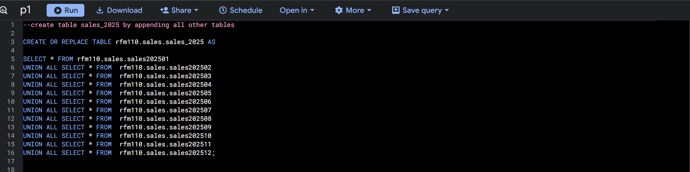
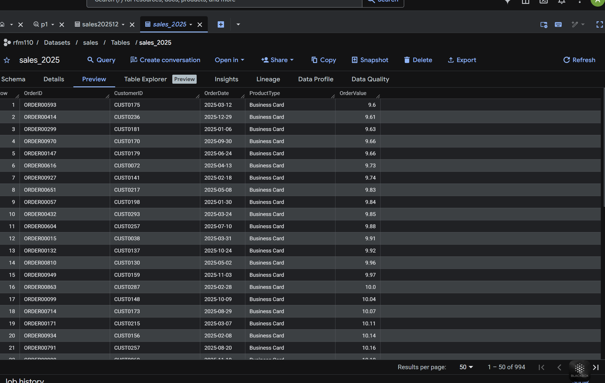
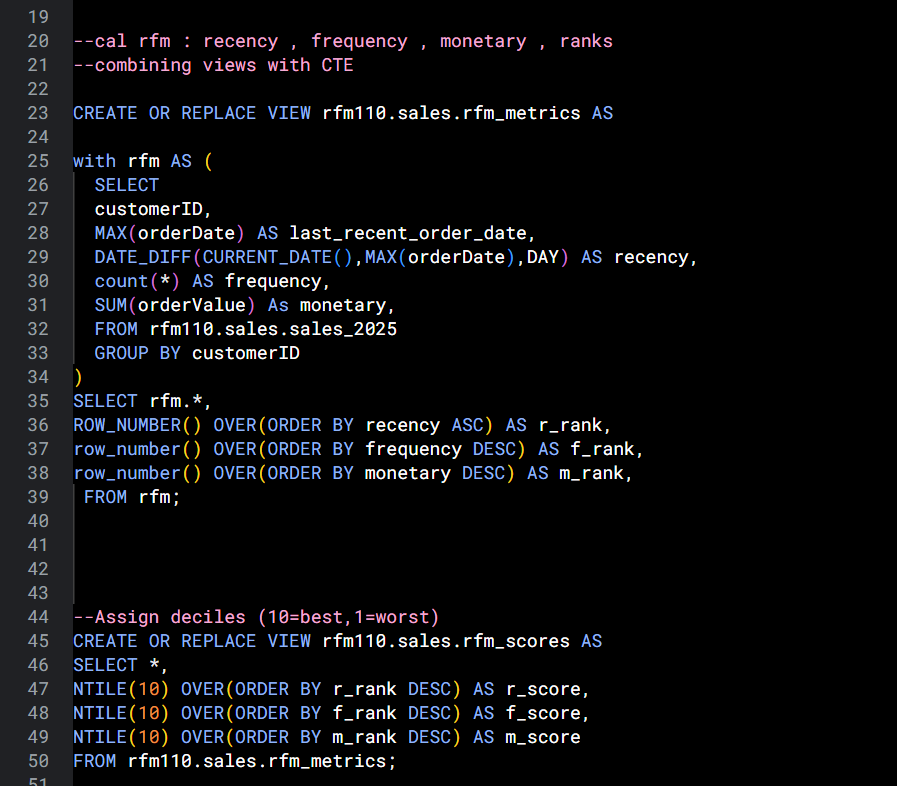
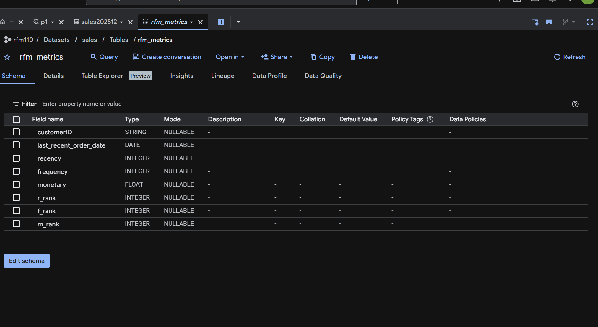
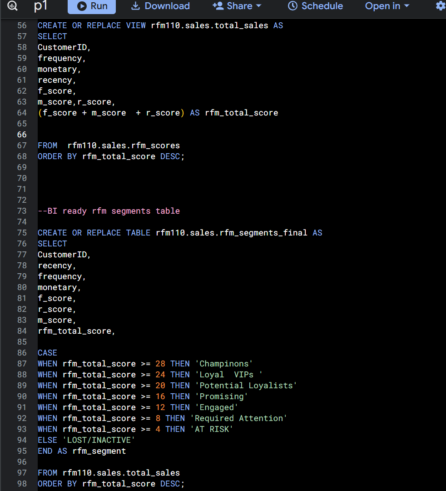
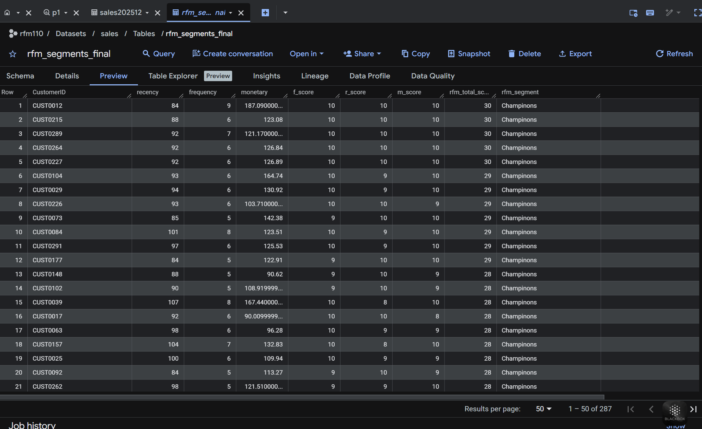

# 📊 RFM Customer Segmentation (SQL + BigQuery + Power BI)

## 📌 Overview

This project performs RFM (Recency, Frequency, Monetary) analysis using SQL in Google BigQuery and visualizes the results in Power BI to identify high-value customers and derive actionable business insights.

---

## 🛠️ Tech Stack

* Google BigQuery (SQL)
* Window Functions, CTEs
* Power BI

---

## 🧠 Key SQL Queries & Results

---

### 🔹 1. Data Consolidation (sales_2025 Table)

**Description:**
This query combines 12 monthly sales tables into a single dataset using `UNION ALL`, creating a unified table for further analysis.

📸 SQL Query:

📸 Output:

---

### 🔹 2. RFM Metrics Calculation

**Description:**
This query calculates key customer metrics:

* **Recency** → Days since last purchase
* **Frequency** → Number of transactions
* **Monetary** → Total spending
  It also ranks customers using window functions to prepare for scoring.

📸 SQL Query:

📸 Output:

---

### 🔹 3. Customer Segmentation (Final Table)

**Description:**
This query assigns customers into business segments (Champions, Loyal VIPs, At Risk, etc.) using RFM scores and `CASE WHEN` logic, producing a BI-ready dataset.

📸 SQL Query:

📸 Output:

---

## 📊 Dashboard (Power BI)

**Description:**
The final dataset is connected to Power BI to visualize customer segments, key KPIs, and detailed customer insights.

📸 Dashboard:

---

## 📈 Key Insights

* Identified high-value “Champion” customers driving revenue
* Detected at-risk customers for retention strategies
* Enabled segmentation-based marketing decisions
* Provided a clear view of customer distribution across segments

---

## 📚 Credits

https://www.youtube.com/watch?v=m13o5aqeCbM&t=1659s

---

## 👤 Author

Akhil Puttabanthi
GitHub: https://github.com/akhil442
